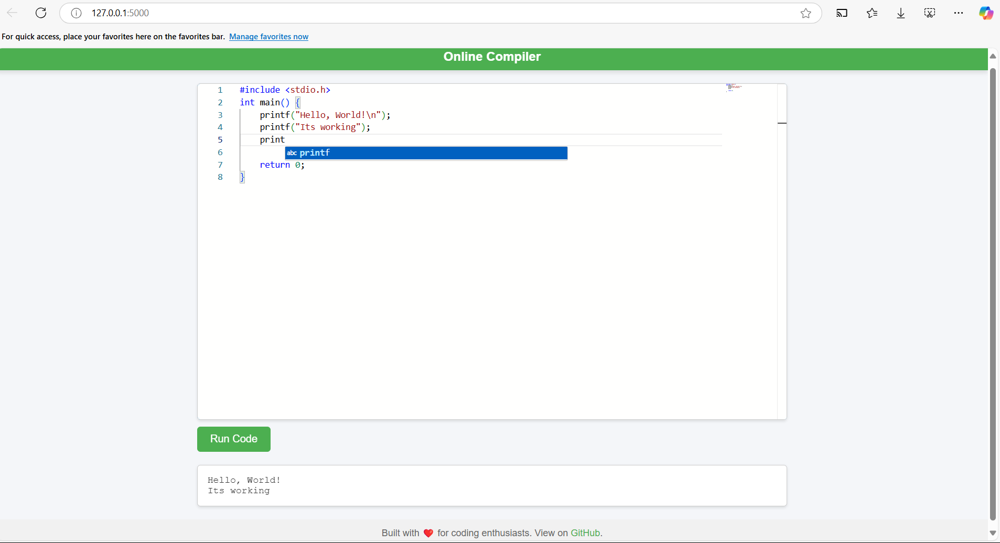

#  Online  Compiler 
This project provides an online compiler for C code, built using Flask and Monaco Editor. It allows users to write and run C code directly from their browser. In the future, it will be upgraded to support multiple programming languages with an improved user interface.

## Features
Code Editor: Monaco Editor for syntax highlighting and code editing.

Run Code: Execute C code directly in the browser and see the output.

Simple and Clean UI: Designed for ease of use, with a responsive interface.

Scalable: Future updates will support multiple programming languages (e.g., Python, Java, JavaScript).

## Technologies Used
### Frontend:

Monaco Editor: A fast, feature-rich code editor.

HTML, CSS, JavaScript (for dynamic content and interaction).

Fetch API for communication with the backend.

### Backend:

Flask: A micro web framework for Python.

CORS: To allow cross-origin requests.

Python’s subprocess: To compile and run C code on the server.
Other:

UUID: For generating unique filenames for the code and output.

Regular expressions (regex) for handling language-specific logic, like class names in Java.

## Setup and Installation
- Clone the Repository:

	```bash
	git clone https://github.com/AshutoshRajS/OnlineCompiler.git
	cd OnlineCompiler

Install Dependencies:
-  Install Python 3 and the required libraries via pip:

	```bash
	pip install -r requirements.txt

Run the Application:
-	To start the Flask application locally, run the following    command:
    ```bash
	python app.py
	Open your browser and visit http://127.0.0.1:5000 to start using the online compiler.

## Screenshot


## Usage
Write Code: Write your C code in the Monaco editor.

Run Code: Click the "Run Code" button to compile and execute the code.

View Output: The output of your code will appear below the editor.
Backend Overview

/run: Accepts POST requests with the user's code and language preference.

Currently supports C language for compiling and running the code.
The backend executes the code via gcc and returns the output or error messages.

## Future Upgrades

The project will be upgraded in the future to support more programming languages. Features planned for the next version include:

Multi-Language Support: Support for Python, Java, JavaScript, and more.
Improved UI: A more modern, feature-rich design.
Enhanced Features: Support for saving code, managing user sessions, and sharing code snippets.
Contributing
Contributions are welcome! If you have any ideas or improvements for this project, feel free to fork the repository and submit a pull request.

# License
This project is licensed under the MIT License - see the LICENSE file for details.